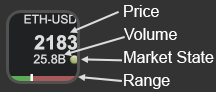
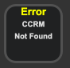

# Stream Stonks

The `Stonks` plugin is not mispelled. It is intended for diamond handed investors to keep an eye on their Stocks and Crypto. 

It originated from the Elgato Plugin Template more information is available from [Stream Deck](https://developer.elgato.com/documentation/stream-deck/).

`Stonks` requires Stream Deck 4.1 or later.

# Description

`Stonks` is a simple plugin that lets you watch stocks and crypto assets. It shows the symbol, price, volume, market state and daily range. 

## Features:

- Stock Market Lookups
- Crypto Lookups
- Limit features (high and low)
- Dynamic button press web actions
- Cross-platform (macOS, Windows)
- Localization support

## Quickstart: Start watching your assets

A short guide to help you getting started quickly.

### Pre-requisites

- Download or install the plugin

### Set the symbol:

For stocks use the stock symbol. You would enter GME. For crypto you will need the coin symbol and the currency you want to display. For Etherium in USD you would enter ETH-USD.

If the plugin runs into any issues or can not find a symbol, you will see a 'Not Found' error state

### Limits:

The plugin will change colors if a high or low limit are set. Aditionally, the url where the button links to can be changed if a limit is triggered.
