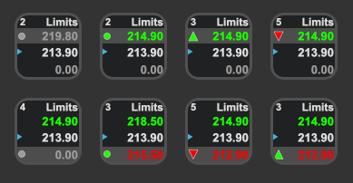

# Stonks

This plugin is intended for diamond handed investors to keep an eye on their investments. Investors can watch stocks and crypto using one plugin. It shows the symbol, price, volume, market state, daily ranges, charts and more... 

If you find bugs or want to see new features please log at ticket in the [github repo](https://github.com/Phando/Streamdeck-Stonks/issues).

## Features:

- Stock Lookups
- Crypto Lookups
- Charting
- Multiple layouts
- Limit notifications
- On device limit adjustments
- Cross-platform (macOS, Windows)

Alternate locales and currencies will be supported in a future releases.

Check the [changelog](Changelog.md) for the latest updates.

## Quickstart

### Set the symbol:

**Stocks** use the stock symbol. AMC, GME, TSLA... 

**Crypto** uses the symbol and currency.  BTC-EUR, ETH-USD, SHIB-USD...

In the Property Inspector, enter your favorite asset symbol and let the data pour in. It should look something like the screen below. 

If the plugin runs into any issues or can not find a symbol, you will see a 'Not Found' error state. If the plugin doesn't recover, restart the Streamdeck app.

## Layout

The primary view of this plugin is focused on the current price. Additional information is supported in footter views. There are footers that show range data which are marked up with a small triangle to indicate that value is from the previous market close. If you choose the *Update Close* option, data in the footers will use today's close as the previous market close after regular market hours. 

### Footer Details

* **None** - Keeping your desktop clean and simple
* **Change** - The decimal and percentage change values since the previous market close. This includes pre, regular and post change amounts.
* **Range** - The highest high and the lowest low since the previous market close. This includes pre, regular and post range amounts.
* **Range%** - This is the same as Range, but in percent format.
* **Range Plus** - This shows the range highs and lows as well as the previous market close. 
* **Range Plus%** - This is the same as Range Plus, but in percent format.
* **Range Viz** - This shows the days range as colored bars with the previous market close as the point where the colors meet. The white indicator shows the current price accounting for pre, regular and post values.
* **Range Viz%** - This is the same as Range Viz, but, you guessed it, in percent format.

## Additional Views

There are additional views to give more information and insight for the assets you are intersted in. These views are generally based on regular market trading data. This aplies to the highs and lows as well as the chart data. In the Property Inspector, you can select which views you would like to see (cycle through) as you click the Streamdeck button.

### View Details 

Single day charts will show a horiontal line indicating the previous market close. Depending on the zoom level of the chart, the line will be omitted as it doesnt fit in the range.

* **Day Decimal** - This shows the day's high, low and previous close for regular trading hours. 
* **Day Percent** - This is the same as Day Decimal, but in percent format.
* **Limits** - This shows the high/low limits thresholds, the previous close as well as whether the limits are enabled. 
* **Chart 30 minutes**
* **Chart 1 hour**
* **Chart 2 hour**
* **Chart 1 day**
* **Chart 5 days**
* **Chart 1 month**
* **Chart 3 months**
* **Chart 6 months**
* **Chart 12 months**

### Market State

The market state is a small indicator to the left of the asset price. During regular trading hours it is invisible. In pre market the top half is colord and the rest is grey. In post market, the bottom half is colored and the rest is grey. When the market is closed, the whole market state indicator is grey. The market state indicator does not show up for crypto assets as the market is always on. 

## Limits

Limits are implemented so users know when to take action or when to let their diamond hands do the hodling. A gradient header is added behind the symbol to indicate the limit state. The image above shows what a high and low limit look like.

It is possible to enable/disable and adjust the limits right on the device. A long press will take the plugin into Limits View. This view is governed by a timer. If the view is left alone, it will self dismiss back to the ticker view. Once in the Limits View clicking the button will adjust what ever section you are on. Limits can be adjusted numerically or by percent. There are several settings around limits explained in the settings details section. 

### Limit Adjustment Order

* **Upper Limit Enable/Disable**
* **Upper Limit Increment** - Skipped if disabled
* **Upper Limit Decrement** - Skipped if disabled
* **Lower Limit Enable/Disable**
* **Lower Limit Decrement** - Skipped if disabled
* **Lower Limit Increment** - Skipped if disabled

## Settings Details

* Title - Ignored
* Symbol - The asset you are looking to track
* Price Trend - Color the price to indicate higher or lower than previous close
* Market State - Display the Market State Indicator
* Fill Charts - Show area charts or line charts
* Update Close - Update the previous close values to today's close after regular market hours
* Initial View - Which view from the *View Checkboxes* is shown as the main screen
* View Checkboxes - Choose which views to display when clicking the Streamdeck button
* Screen Time - Sets the duration timer for the Limits View adjustments
* Viz Limits - Show the limits on the *Viz* footers
* Limit Type - Choose between numerical or percentage limits
* Increment - The increment amount to be used when clicking the button in *Limits View*
* Upper Limit Enabled - Enable or disable the Upper Limit
* Upper Limit - The threshold value to trigger the Upper Limit
* Lower Limit Enabled - Enable or disable the Lower Limit
* Lower Limit - The threshold value to trigger the Lower Limit
* Restore Deflauts - Click this button to reset all the plugin settings. 

## Technical Details

Tiny numbers like the price of SHIB are shown in an abbreviated form. The abbreviation trims all but one leading zero and adds a tick. **0.00003968** is shown as **`03968**

Values for highs and lows shown in the footers extends into pre and post market values.

To view the output of the plugin you can point a browser to 
[http://localhost:23654](http://localhost:23654) and click on *com.andomation.stream.stonks*.

###Requirements

Stream Deck 4.1 or later.

If you find bugs or want to see new features please log at ticket in the [github repo](https://github.com/Phando/Streamdeck-Stonks/issues).