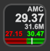

# Stonks

This plugin is intended for diamond handed investors to keep an eye on their investments. Investors can watch stocks and crypto using one plugin. It shows the symbol, price, volume, market state, daily ranges, charts and more... 

If you find bugs or want to see new features please log a ticket in the [github repo](https://github.com/Phando/Streamdeck-Stonks/issues).

Enjoying the plugin, please [donate](https://buy.stripe.com/cN26rW40l4Vl3YsdQQ)

## Features:

- Stock Lookups
- Crypto Lookups
- Charting
- Multiple layouts
- Limit notifications
- On device limit adjustments
- Currency Conversion
- Cross-platform (macOS, Windows)

Alternate locales and currencies will be supported as they become available.

Check the [changelog](Changelog.md) for the latest updates.

## Quickstart

### Set the symbol:

This plugin is streaming data from [Yahoo Finance](https://finance.yahoo.com). If ever you have trouble locating a symbol, do a lookup on the Yahoo Finance website and copy the found symbol into your Stonks settings. 

**Stocks** use the stock symbol. AMC, GME, TSLA... 

**Crypto** uses the symbol and -USD, there is a currency setting which can be used to translate Crypto values.  BTC-USD, ETH-USD, SHIB-USD...

**Exchanges** uses the currency1 + currency2 + =X, EURUSD=X, EURGBP=X...

In the Property Inspector, enter your favorite asset symbol and let the data pour in. It should look something like the screen below. 

If the plugin runs into any issues or can not find a symbol, you will see a 'Not Found' error state. If the plugin doesn't recover, restart the Streamdeck app.

## Overview

The values shown in this plugin represent a snapshot of the current market state. The price, high, low, and change values extend into pre and post market data. To see values that pertain to the day's regular market activity, please see the *Day Numeric* and *Day Percent* views. The plugin uses the previous day's close values throughout. This value will be marked up with a small blue triangle. If you would like to update the close value to today's close after regular trading hours, choose the *Update Close* option in the property inspector.

 
 
There are many views packed into this plugin and you can pick and choose the ones that are relevant to your trading style. Additionally, you have the option to pick your initial or home view. The selected views will cycle with each click of your Streamdeck button. Charts that span 24 hours show the previous close as a dashed line across the chart.

### View Types

* **None** - Keeping your desktop clean and simple
* **Change** - The decimal and percentage change values since the previous market close. This includes pre, regular and post change amounts.
* **Range** - The highest high and the lowest low since the previous market close. This includes pre, regular and post range amounts.
* **Range%** - This is the same as Range, but in percent format.
* **Range Plus** - This shows the range highs and lows as well as the previous market close. 
* **Range Plus%** - This is the same as Range Plus, but in percent format.
* **Range Viz** - This shows the day's range as colored bars with the previous market close as the point where the colors meet. The white indicator shows the current price accounting for pre, regular and post values.
* **Range Viz%** - This is the same as Range Viz, but, you guessed it, in percent format.
* **Day Decimal** - This shows the day's high, low and previous close for regular trading hours. 
* **Day Percent** - This is the same as Day Decimal, but in percent format.
* **Limits** - This shows the high/low limits thresholds, the previous close as well as whether the limits are enabled. 
* **Chart 30 minutes**
* **Chart 1 hour**
* **Chart 2 hour**
* **Chart 1 day**
* **Chart 5 days**
* **Chart 1 month**
* **Chart 3 months**
* **Chart 6 months**
* **Chart 12 months**

### Market State

The market state is a small indicator to the left of the asset price. During regular trading hours it is invisible. In pre market the top half is colored and the rest is grey. In post market, the bottom half is colored and the rest is grey. When the market is closed, the whole market state indicator is grey. The market state indicator does not show up for crypto assets as the market is always open. 

## Long Press

Using the **long press** you can define a URL to open in your browser.

## Limits

Limits are implemented so users know when to take action or when to let their diamond hands do the hodling. A gradient header is added behind the symbol to indicate the limit state. The image above shows what active high and low limits look like. If the *Viz Limits* option is selected, hollow sections will be added to the Viz bar to show where limits are set. If limits are set outside of the day's high and low, the Viz will be extended and the limit will be at the edge of the screen.

Use the property inspector to enable/disable and adjust the limits.

## Settings Details

* **Title** - Ignored
* **Symbol** - The asset you are looking to track
* **Currency** - The currency numeric values will be displayed in. 
* **Max Digits** - The number of significant characters to show. 
* **Price Trend** - Color the price to indicate higher or lower than previous close
* **Market State** - Display the Market State Indicator
* **Fill Charts** - Show area charts or line charts
* **Update Close** - Update the previous close values to today's close after regular market hours
* **Initial View** - Which view from the *View Checkboxes* is shown as the main screen
* **View Checkboxes** - Choose which views to display when clicking the Streamdeck button
* **Type** - Choose between numerical or percentage limits
* **Viz Limits** - Show the limits on the *Viz* footers
* **Upper Limit Enabled** - Enable or disable the Upper Limit
* **Upper Limit** - The threshold value to trigger the Upper Limit  
* **Lower Limit Enabled** - Enable or disable the Lower Limit
* **Lower Limit** - The threshold value to trigger the Lower Limit
* **Restore Defaults** - Click this button to reset all the plugin settings. 

## Technical Details

For crypto **always** use the **-USD** extension: ETH-USD. The currency setting below the symbol is used to specify value translations.

Tiny numbers like the price of SHIB are shown in an abbreviated form. The abbreviation trims all but one leading zero and adds a tick. **0.00003968** is shown as **`03968**

To view the output of the plugin you can point a browser to 
[http://localhost:23654](http://localhost:23654) and click on *com.andomation.stream.stonks*.

### Issues
If you find bugs or want to see new features please log at ticket in the [github repo](https://github.com/Phando/Streamdeck-Stonks/issues).

### Requirements

Stream Deck 4.1 or later.

Enjoying the plugin, please [donate](https://buy.stripe.com/cN26rW40l4Vl3YsdQQ)

### DEBUGGING
To Debug you will need to run:
defaults write com.elgato.StreamDeck html_remote_debugging_enabled -bool YES